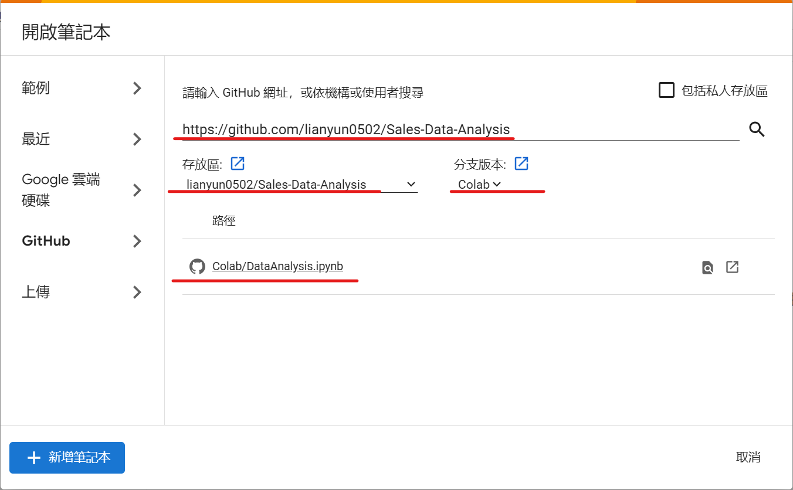

# Sales Data Analysis

### Description

You are given a CSV file (sales_data.csv) containing sales data for a company. The file has the following columns: Date, Product, Units Sold, Unit Price, and Total Revenue.

Your task is to create a Python script that performs the following tasks:

1. Read Data: Load the data from the CSV file into a suitable data structure (e.g., Pandas DataFrame).

2. Data Cleaning: Check for any missing values or inconsistencies in the data. Handle them appropriately (e.g., by removing rows with missing values).

3. Total Revenue Calculation: Calculate the total revenue for each product by multiplying the 'Units Sold' and 'Unit Price' columns.

4. Monthly Sales Report: Generate a monthly sales report that includes the total units sold and revenue for each product for each month.

5. Best Performing Product: Identify the best-performing product based on the total revenue.

6. Plotting: Create visualizations (e.g., bar charts, line charts) to represent the monthly sales and compare the performance of different products.

# Get Started

### Run with Colab

To run a GitHub notebook in Google Colab, follow these steps:

1. Open Google Colab https://colab.research.google.com/.

2. Open notebook, select the "GitHub" tab.

3. In the "Enter a GitHub URL or search by organization or user" box, paste the URL of the GitHub notebook `https://github.com/lianyun0502/Sales-Data-Analysis.git`.

4. Select the repository `Sales-Data-Analysis` and branch `Colab` from the dropdown menus, then choose the notebook `DataAnalysis.ipynb` to open.

5. You can now run the notebook in Google Colab by clicking on the "Runtime" menu and then "Run all".

### Run with VS code

* **On local machine with virtual environment**

1. recoomented run on `windows 10` or above.

2. Clone the repository `https://github.com/lianyun0502/Sales-Data-Analysis.git` to your local machine.

3. Using Python 3.9 or above, recommended  `3.9.13`, you can use `virtualenv` or `poetry` to create a virtual environment to run the notebook on VS Code.

4. Install the required packages in the virtual environment by running `pip install -r requirements.txt` or `poetry install`.
